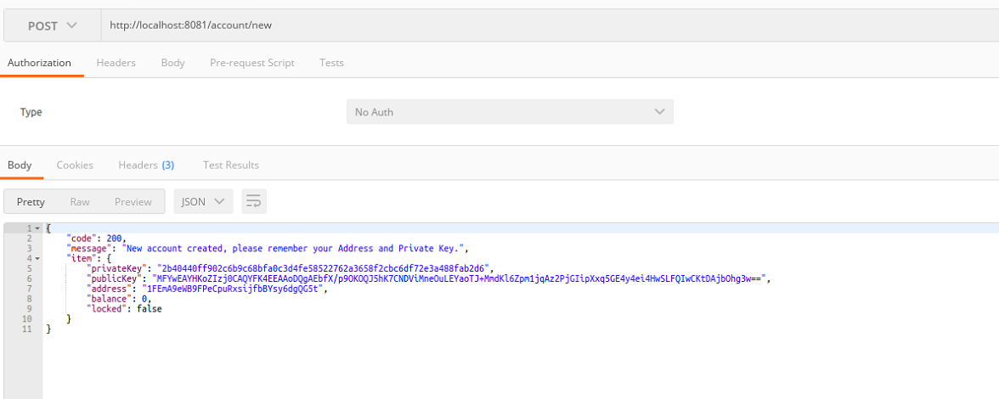
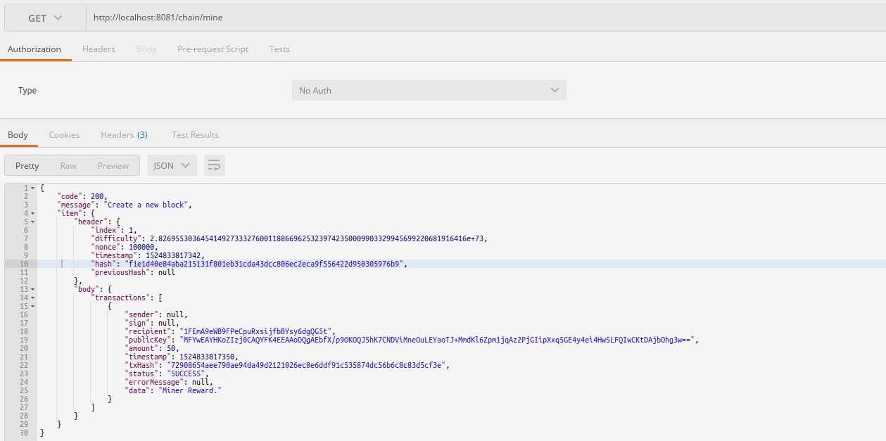
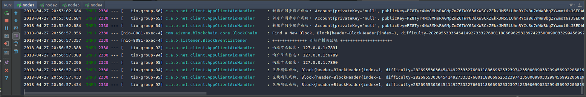
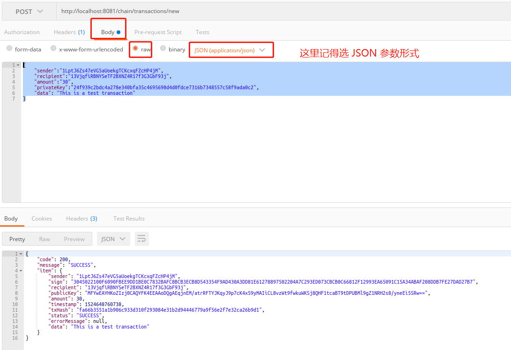
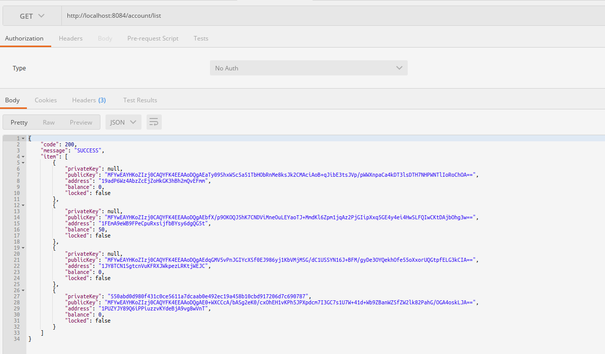
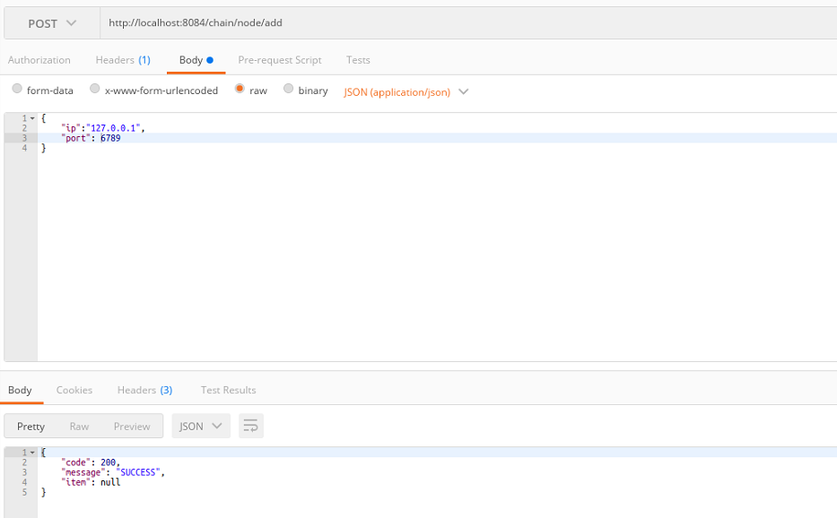
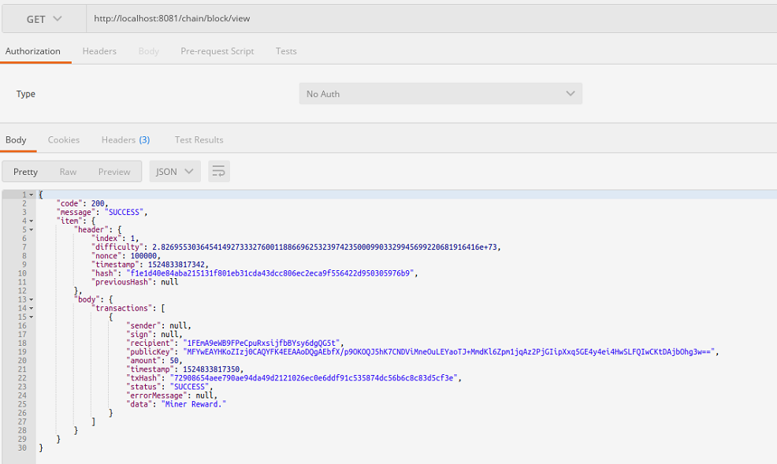

# blockchain-java

> 区块链钱包 Java 的简易实现版，自学了一段时间的区块链理论知识，自己尝试着写一个具有钱包雏形的区块链项目，开源出来，
供像我一样想开发区块链又不知从何下手初学者参考。目前大部分区块链从业者都是从事 DApp 开发，做底层链开发的还是比较少，目前也没有很大必要，
不过尝试写链可以更好的理解区块链底层的运行逻辑。本人在开发的过程中最大的体会是，在理论学习的时候觉得区块链知识并不复杂，
理论自己都懂了，但是真要自己实现了就会发现有各种坑，最后才发现自己对某些细节理解还是一知半解。
希望这个项目能对初学区块链者有所帮助，大家一起学习，一起成长。

### Version 1.1
1. 将项目名称修改为 ppblock
2. 重构钱包生成算法，修改了签名算法，新增通过助记词创建钱包, 新增生成 keystore file 钱包文件功能
3. 支持通过私钥字符串， 助记词，助记词+密码，keystore + 密码等多种方式恢复钱包(此处可以点赞)
4. 修改了交易(Transaction) 和账户（Account)实体的数据结构, 职责更加明确，Account 不在存储公钥等数据，只存储地址和余额。
5. 鉴于网上很多同学都吐槽说项目启动的时候一直不断的抛出异常，其实这是系统启动之后自动同步其他节点的最新区块数据导致的,因为 tio 
配置的初始同步节点都没有启动，所以一直抛出连接超时的异常，其实这并不影响系统运行，但是为了方便那些有强迫症的同学（本人也是强迫症患者）, 增加了　node-discover 配置，可以手动关闭　p2p　网络同步，作为单节点测试运行。
6. 添加发送交易后自动挖矿功能，可配置成手动挖矿，默认是自动挖矿，如果初学者建议配置手动挖矿，这样你能更清楚的了解整个区块链交易工作的流程
7. 修复了一些已知的　Bug...

### 下个版本开发计划
完成钱包的 UI 界面开发， 不再使用 postman 工具来测试，做到开箱即用.


### Version 1.0
1. 初步了完成的区块链的各个模块，包括账户，区块链，网络等模块实现
2. 实现了账户创建，发送交易和挖矿功能
3. 实现了网络功能，包括发送广播账户，广播区块，广播交易以及自动同步区块功能。

## 单节点部署
__这个很简单, 直接像运行普通的 SpringBoot 项目一样运行就好了，单节点默认使用的 node1 节点的配置__

## 多节点部署
项目默认部署4个节点，创建了4个配置文件 application-{env}.yml， 
如果想要部署更多的节点，再创建更多的配置文件就 OK 了。

使用 idea 部署测试非常简单，按照下面的方法添加多个 springBoot 启动配置。


然后分别启动 4 个节点就好了。启动之后节点之间自动连接成 P2P 网络，随后你就可以使用 postman 工具进行测试了，如果没有安装 postman 的话请自行安装，或者和我一样使用 chrome 浏览器的 postman 扩展。

## Web 测试 API

API名称 | 请求方式 | URL 
--------|---------|------
生成钱包 | POST | /account/new
查看钱包列表 | GET | /account/list
启动挖矿 | GET | /chain/mine
发送交易 | POST | /chain/transactions/new
查看最后一个区块 | GET | /chain/block/view
添加节点 | POST | /chain/node/add
查看节点 | GET | /chain/node/view

> 注意：凡是 POST 请求都是使用 RequestBody 的方式传参的， 不是用表单的 form-data 形式， 比如发送交易的参数形式如下：

```
{
    "name" : "value",
    "name2" : "value2"
}
```
## 简单测试
首先依次启动 node1 - node4 4个节点，由于在启动的时候会自动链接初始化的节点，各自连接成为一个 P2P 的网络，所以被链接的节点没有启动的时候会抛出网络异常，不用管它，等其他节点启动好了之后又会自动连接上的。

**下面贴出各操作的截图**

> 创建钱包账户 http://127.0.0.1:8081/account/new



> 挖矿， 挖矿之前要先创建挖矿钱包，操作跟上面相同 <br/>
http://127.0.0.1:8081/chain/mine





> 发送交易， http://127.0.0.1:8081/chain/transactions/new
 
 请求方式为 POST， 参数如下
````
{
	"sender":"1LptJ6Zs47eVG5aUoekgTCKcxqFZcHP4jM",
	"recipient":"13VjqfiRBNYSeTF2BXNZ4R17f3G3GbF93j",
	"amount":"30",
	"privateKey":"24f939c2bdc4a278e340bfa35c4695698d4d0fdce7316b7348557c58f9ada0c2",
	"data": "This is a test transaction"
}
````



> 查看账户列表， http://127.0.0.1:8081/account/list



> 添加节点， http://127.0.0.1:8081/chain/node/add



> 查看区块， http://127.0.0.1:8081/chain/block/view



> 千呼万唤始出来，讨论群来了：


