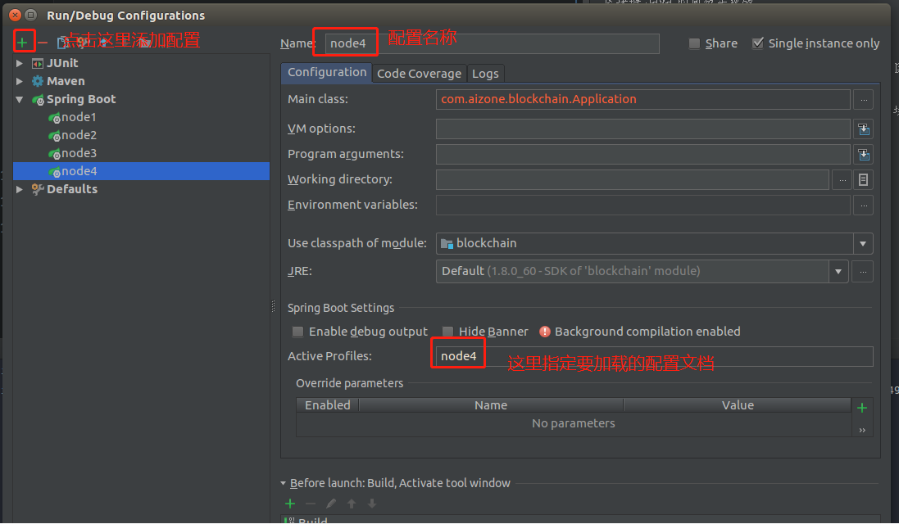
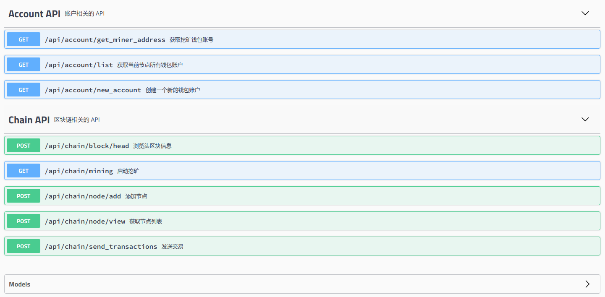

# jblock

Java实现的一个简易区块链（联盟链）项目，包括加密工具，钱包，P2P 传输，区块同步，POW 共识等基础实现。

-----------------------------------------------


## 单节点部署
__这个很简单, 直接像运行普通的 SpringBoot 项目一样运行就好了，单节点默认使用的 node1 节点的配置__

## 多节点部署
项目默认部署3个节点，创建了3个配置文件 application-{env}.yml， 
如果想要部署更多的节点，再创建更多的配置文件就 OK 了。

使用 idea 部署测试非常简单，按照下面的方法添加多个 springBoot 启动配置。



然后分别启动 3 个节点就好了。启动之后节点之间自动连接成 P2P 网络，随后你就可以使用 postman 工具进行测试了，如果没有安装 postman 的话请自行安装，或者和我一样使用 chrome 浏览器的 postman 扩展。

## 简单测试
首先依次启动 node1 - node3 3个节点，由于在启动的时候会自动链接初始化的节点，各自连接成为一个 P2P 的网络，所以被链接的节点没有启动的时候会抛出网络异常，不用管它，等其他节点启动好了之后又会自动连接上的。

你可以使用 PostMan 工具对上面的 RESTFUL api 进行一一测试。不过从 v1.2 之后我在项目中集成了 swagger2，所以现在更好的测试是直接使用 swagger 
的 api ui 页面进行测试： http://localhost:8081/swagger-ui.html

 
 
 直接点击相应的 api 进行测试就 OK 了。
 
 ## Web 测试 API
 
 API名称 | 请求方式 | URL 
 --------|---------|------
 生成钱包 | POST | /api/wallet/new_account
 查看钱包列表 | GET | /api/wallet/list
 获取挖矿账号 | GET | /api/wallet/get_miner_address
 启动挖矿 | GET | /api/chain/mining
 发送交易 | POST | /api/chain/send_transactions
 查看最后一个区块 | GET | /api/chain/block/head
 添加节点 | POST | /api/chain/node/add
 查看节点 | GET | /api/chain/node/view
 
 > 注意：凡是 POST 请求都是使用 RequestBody 的方式传参的， 不是用表单的 form-data 形式， 比如发送交易的参数形式如下：
 
 ```
 {
     "name" : "value",
     "name2" : "value2"
 }
 ```

